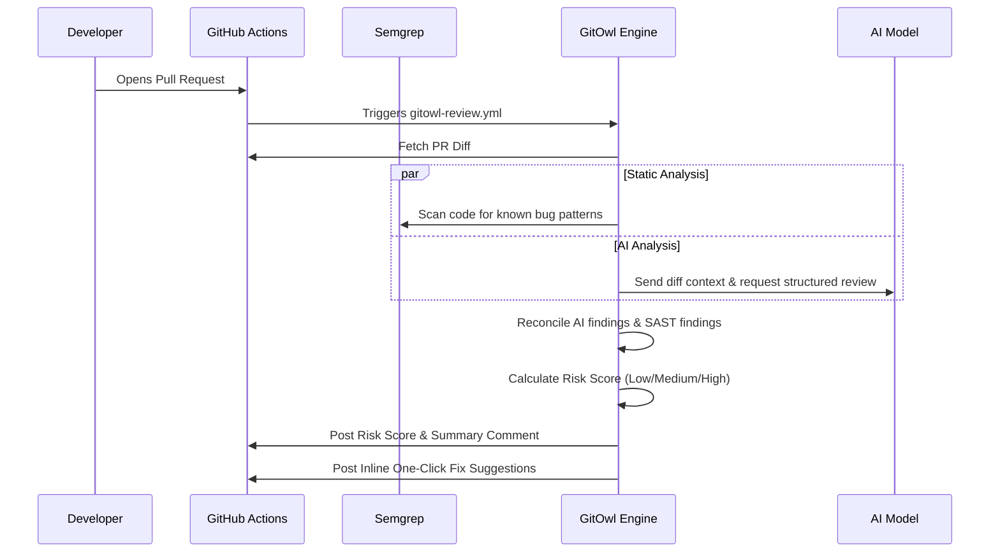

<div align="center">
  

  # GitOwl
  **AI Code Review Engine that lives inside your pull requests.**

  *Filters out noise, scores PR risk, and drops inline suggestions before a human even looks at the code.*
  <br/>
  **Created by Manthan Dubey**

  [](https://gitowl.vercel.app)
  [](https://pypi.org/project/gitowl/)
  [](https://www.python.org/)
  [](LICENSE)
  [](https://github.com/MarutiDubey/GitOwl/actions/workflows/ci.yml)

  <br/>

  
  
  
  
  

  <br/>

  **Why I built this:** *Reviewing PRs shouldn't be a bottleneck. I wanted an engine that gives me a quick summary, flags real issues with reasoning, and scores the risk level so I know exactly what needs my attention.*

  <br/>

  [**Live Playground**](https://gitowl.vercel.app) | [**Install**](#-install--use-locally) | [**GitHub Action**](#a-github-action) | [**GitHub App**](#b-github-app) | [**Report Bug**](https://github.com/MarutiDubey/GitOwl/issues)

</div>

---

## 📑 Table of Contents

- [🎯 Who Is This For?](#-who-is-this-for)
- [✨ Features](#-features)
- [🏗️ Architecture](#️-architecture)
- [⚡ Quick Start](#-quick-start)
  - [A · GitHub Action](#a-github-action)
  - [B · GitHub App](#b-github-app)
- [🛠️ Tech Stack](#️-tech-stack)
- [📦 Install & Use Locally](#-install--use-locally)
- [⚙️ Configuration](#️-configuration-gitowltoml)
- [🧑‍💻 Local Development](#-local-development)
- [🤝 Contributing](#-contributing)
- [📄 License](#-license)
- [👨‍💻 Built By](#-built-by)

---

## 🎯 Who Is This For?

GitOwl is for **engineering teams** that want a second set of eyes on every pull request without the overhead of waiting for a human review cycle to start. It works on any repository — private or public — and runs on any AI provider you already use.

- **Small teams** — get senior-engineer-level review feedback even when bandwidth is limited.
- **Open-source maintainers** — triage incoming PRs before spending time on them yourself.
- **Security-conscious orgs** — catch OWASP Top 10 issues and hardcoded secrets before they merge.
- **Any CI pipeline** — runs in GitHub Actions, no new infrastructure needed.

Try the live playground at [**gitowl.vercel.app**](https://gitowl.vercel.app) — paste any unified diff and get a structured review in seconds.

---

## ✨ Features

- 🔎 **Smart AI Code Review** — Focuses on context and logic, not just syntax matching. Drastically reduces false positives.
- 🚦 **Risk Scoring** — Automatically scores every PR as Low, Medium, or High risk based on the diff complexity.
- 🛡️ **Static Analysis Integration** — Pairs AI with Semgrep to catch known vulnerabilities instantly (optional).
- ✍️ **One-Click Fixes** — Drops GitHub inline suggestions for easy commits.
- 📝 **Auto PR Descriptions** — Generates a title, summary, and change list from the raw diff.
- 🧠 **Structured Security Insights** — Identifies security issues with OWASP Top 10 context and actionable remediation.
- ⚙️ **Team-Wide Config** — A committed `.gitowl.toml` sets severity thresholds and ignored paths for the whole repo.
- 💸 **Cost Tracking** — Logs token usage, cost, and latency for every review.
- 🔌 **Provider-Agnostic** — Use any API key (OpenAI, Gemini, OpenRouter, local Ollama).

---

## 🏗️ Architecture

GitOwl runs as an automated first-pass reviewer. It reads the diff, runs optional static analysis in parallel, asks an AI model to produce a structured JSON review, reconciles both signals, scores risk, and posts the result directly onto the PR.



### Module Layout

| Module | Purpose |
|--------|---------|
| `gitowl/cli.py` | Entry point for all CLI subcommands (`review-diff`, `review-pr`, `describe-diff`, `describe-pr`, `providers`) |
| `gitowl/reviewer.py` | Core orchestrator: diff → Semgrep → AI → risk score → `ReviewResult` |
| `gitowl/github_client.py` | Thin GitHub REST client: fetch diffs, post comments, post check runs |
| `gitowl/ai_client/` | Provider-agnostic AI layer: OpenAI-compatible, Ollama, registry |
| `gitowl/ai_client/prompt.py` | System prompt construction and JSON response parsing |
| `gitowl/models.py` | Shared data contracts: `Finding`, `ReviewResult`, `RiskLevel`, `UsageStats` |
| `gitowl/config.py` | Config loading from `.gitowl.toml` + environment variables |
| `gitowl/comment.py` | Render a `ReviewResult` as a formatted Markdown PR comment |
| `gitowl/risk.py` | Heuristic risk scoring (reconciled with the AI's score) |
| `gitowl/policy.py` | Apply repo policy: filter by severity and ignored paths |
| `gitowl/diff_utils.py` | Parse and compress unified diffs |
| `gitowl/semgrep_runner.py` | Optional Semgrep integration (auto-detected at runtime) |
| `gitowl/suggest.py` | Build committable inline suggestions from AI findings |
| `gitowl/describe.py` | Auto-generate PR title, summary, and change list |
| `gitowl/pricing.py` | Token-cost estimation with per-model price table |
| `gitowl/eval/` | Evaluation harness: precision/recall/F1 against a seeded bug corpus |
| `api/review.py` | Vercel serverless function powering the live playground |
| `playground/web/` | React + Vite + TypeScript frontend for gitowl.vercel.app |

---

## ⚡ Quick Start

Choose the integration that fits your setup. Both use the same review engine.

### A · GitHub Action

The simplest path: copy one file, add one secret, open a PR.

#### Step 1 — Add the workflow

Copy [`examples/gitowl-review.yml`](examples/gitowl-review.yml) into your repository at `.github/workflows/gitowl-review.yml`:

```yaml
name: GitOwl Review

on:
  pull_request:
    types: [opened, synchronize, reopened]

permissions:
  contents: read
  pull-requests: write
  checks: write

jobs:
  review:
    runs-on: ubuntu-latest
    steps:
      - uses: actions/checkout@v4
        with: { fetch-depth: 0 }

      - uses: actions/setup-python@v5
        with: { python-version: "3.11" }

      - name: Install GitOwl
        run: pip install gitowl

      - name: Run GitOwl review
        env:
          AI_PROVIDER: ${{ vars.AI_PROVIDER || 'openrouter' }}
          AI_BASE_URL: ${{ vars.AI_BASE_URL || 'https://openrouter.ai/api/v1' }}
          AI_MODEL: ${{ vars.AI_MODEL || 'openai/gpt-4o-mini' }}
          AI_API_KEY: ${{ secrets.AI_API_KEY }}
          GITHUB_TOKEN: ${{ secrets.GITHUB_TOKEN }}
        run: |
          gitowl review-pr \
            "${{ github.repository }}" \
            "${{ github.event.pull_request.number }}" \
            --post --suggest
```

#### Step 2 — Add your API key

Go to **Settings → Secrets and variables → Actions** and add a repository secret named `AI_API_KEY`.
*(Any OpenAI-compatible provider key works — OpenRouter, OpenAI, Gemini, Ollama, etc.)*

#### Step 3 — Open a pull request

GitOwl reviews the diff and posts its comment automatically.

> [!NOTE]
> Want Semgrep static analysis alongside the AI review? Install with `pip install "gitowl[semgrep]"` and add `checks: write` to the workflow permissions.

---

### B · GitHub App

The GitHub App integration lets you install GitOwl **once across an organization or set of repositories** — no workflow YAML to copy into each repo, no per-repo secrets to manage.

| | GitHub Action | GitHub App |
|---|---|---|
| **Setup per repo** | Copy 1 YAML + 1 secret | Zero — install once |
| **API key** | Your key, stored as repo secret | Managed by the app host |
| **Self-hosted** | Always | When you host the webhook server |
| **Permissions** | Defined in the workflow | Defined once in the app manifest |
| **Best for** | Individual repos, full control | Orgs, many repos, shared rollout |

#### Option 1 — Use a hosted GitOwl App *(coming soon)*

A hosted GitOwl App will be available on the GitHub Marketplace. Once listed, install it on your org in one click and set your AI provider key in the app settings — no YAML, no workflow changes.

#### Option 2 — Self-host the webhook server

GitOwl's review engine is a plain Python library. You can wire it to a GitHub App webhook in a few dozen lines:

```python
# webhook_server.py — minimal GitHub App receiver
from fastapi import FastAPI, Request, HTTPException
import hashlib, hmac, os

from gitowl.config import load_config
from gitowl.reviewer import review_diff
from gitowl.comment import render_comment
from gitowl.github_client import GitHubClient

app = FastAPI()
WEBHOOK_SECRET = os.environ["GITHUB_WEBHOOK_SECRET"]

def verify_signature(payload: bytes, sig_header: str) -> bool:
    expected = "sha256=" + hmac.new(
        WEBHOOK_SECRET.encode(), payload, hashlib.sha256
    ).hexdigest()
    return hmac.compare_digest(expected, sig_header)

@app.post("/webhook")
async def handle(request: Request):
    payload = await request.body()
    sig = request.headers.get("X-Hub-Signature-256", "")
    if not verify_signature(payload, sig):
        raise HTTPException(401, "bad signature")

    event = request.headers.get("X-GitHub-Event")
    body = await request.json()

    if event == "pull_request" and body["action"] in ("opened", "synchronize"):
        repo   = body["repository"]["full_name"]
        pr_num = body["number"]

        config = load_config()
        client = GitHubClient(config.github_token)
        diff   = client.fetch_pr_diff(repo, pr_num)
        review = review_diff(diff, config)
        body_md = render_comment(review.result, review.stats)
        client.post_or_update_comment(repo, pr_num, body_md)

    return {"ok": True}
```

To register the GitHub App:
1. Go to **GitHub → Settings → Developer settings → GitHub Apps → New GitHub App**.
2. Set the **Webhook URL** to your server's `/webhook` endpoint.
3. Grant **Pull requests: Read & Write** and **Checks: Write** permissions.
4. Subscribe to the **Pull request** event.
5. Generate and download the private key; use it to create an installation token for the `GitHubClient`.

---

## 🛠️ Tech Stack

| Layer | Tools |
|---|---|
| **Core engine** | Python 3.11+, `httpx`, `unidiff` |
| **AI layer** | Provider-agnostic (any OpenAI-compatible API, local Ollama) |
| **Static analysis** | Semgrep (optional, auto-detected at runtime) |
| **Distribution** | PyPI package + GitHub Action |
| **Playground** | React + Vite + TypeScript frontend, FastAPI serverless API (Vercel) |
| **Quality** | `pytest` with full unit + integration coverage, `ruff`, `black`, `isort`, strict `mypy`, `pip-audit`, precision/recall Eval Harness |
| **CI** | GitHub Actions — lint, type-check, test, eval gate, security scan on every push/PR |

---

## 📦 Install & Use Locally

```bash
pip install gitowl          # AI-only review
pip install "gitowl[semgrep]"  # AI review + Semgrep static analysis
```

### CLI commands

```bash
# Review a unified diff — from a file, or piped from git
gitowl review-diff my.diff
git diff main...HEAD | gitowl review-diff -

# Review a GitHub PR and print the result
gitowl review-pr owner/repo 42

# Review a GitHub PR and post the comment back onto the PR
gitowl review-pr owner/repo 42 --post

# Also post one-click committable fix suggestions as inline review comments
gitowl review-pr owner/repo 42 --post --suggest

# Generate a PR description from a diff file
gitowl describe-diff my.diff

# Generate a PR description from a live GitHub PR and write it back
gitowl describe-pr owner/repo 42 --post

# Skip Semgrep for any review command
gitowl review-diff my.diff --no-semgrep

# List configured AI providers
gitowl providers
```

### Environment variables

Configure once in a local `.env` file (see [`.env.example`](.env.example)) or export in your shell:

| Variable | Default | Description |
|----------|---------|-------------|
| `AI_API_KEY` | *(required)* | API key for your AI provider |
| `AI_PROVIDER` | `openrouter` | Provider name: `openrouter` \| `openai` \| `ollama` |
| `AI_MODEL` | `openai/gpt-4o-mini` | Model identifier passed to the provider |
| `AI_BASE_URL` | *(provider default)* | Override the API base URL (e.g. for a local Ollama or Gemini endpoint) |
| `GITHUB_TOKEN` | *(required for PR commands)* | Personal access token or `${{ secrets.GITHUB_TOKEN }}` |
| `SEMGREP_TIMEOUT_SECONDS` | `60` | Max time allowed for a Semgrep scan |
| `MAX_DIFF_LINES` | `2000` | Diffs larger than this are compressed before review |
| `LOG_LEVEL` | `INFO` | Logging verbosity: `DEBUG` \| `INFO` \| `WARNING` \| `ERROR` |

> [!IMPORTANT]
> **API Security:** API keys are read only from the environment or `.env` (which is git-ignored). They are never stored in `.gitowl.toml` or any committed file.

---

## ⚙️ Configuration (`.gitowl.toml`)

Drop a `.gitowl.toml` at your repo root to set project-wide review policy. It is committed, so the whole team shares the same rules:

```toml
[review]
min_severity = "warning"                       # info | warning | error
ignore_paths = ["tests/**", "**/*.md"]         # globs GitOwl will not flag

[ai]
model = "your-model-name"                      # pin a model for this repo

[pricing]
# Override per-model costs (input, output) in USD per 1 M tokens.
# Leave this section out to use GitOwl's built-in price table.
"openai/gpt-4o-mini" = [0.15, 0.60]
```

**Precedence** (low → high): built-in defaults → `.gitowl.toml` → environment variables.
The repo file sets the team baseline; a CI secret or shell `export` always wins for a single run. API keys are never read from this file.

---

## 🧑‍💻 Local Development

### 1 · Clone and set up

```bash
git clone https://github.com/MarutiDubey/GitOwl.git
cd GitOwl

python -m venv .venv
# Windows
.venv\Scripts\activate
# macOS / Linux
source .venv/bin/activate

pip install -r requirements-dev.txt
pip install -e .          # editable install so `gitowl` CLI reflects your changes
```

### 2 · Configure environment

```bash
cp .env.example .env
# Edit .env and fill in AI_API_KEY and GITHUB_TOKEN
```

### 3 · Install pre-commit hooks

The hooks run `ruff`, `black`, `isort`, and several safety checks on every commit:

```bash
pre-commit install
pre-commit run --all-files   # verify everything passes on the current tree
```

### 4 · Run the test suite

```bash
pytest                       # all tests
pytest -v                    # verbose output
pytest --cov=gitowl --cov-report=term-missing   # with coverage
pytest -m "not integration"  # skip integration tests (no API key needed)
```

### 5 · Type-check and lint

```bash
mypy gitowl
ruff check gitowl tests
black --check gitowl tests
isort --check-only gitowl tests
```

### 6 · Run the evaluation harness

The eval harness scores GitOwl against a seeded corpus of known bugs and checks that precision × recall F1 stays above the gate:

```bash
python -m gitowl.eval                    # full report
python -m gitowl.eval --fail-under 0.80  # exit 1 if F1 < 0.80 (same as CI)
```

### 7 · Run the playground locally

```bash
cd playground/web
npm install
npm run dev         # Vite dev server at http://localhost:5173

# In a separate terminal, run the API:
cd api
pip install fastapi uvicorn
uvicorn review:app --reload --port 8000
```

---

## 🤝 Contributing

Contributions are welcome. Here's how to get involved:

### Reporting bugs

Open an [issue](https://github.com/MarutiDubey/GitOwl/issues) using the **Bug report** template. Include:
- The command you ran (redact any API keys)
- The diff or PR that triggered the problem, if possible
- The full error output (`--log-level DEBUG` gives more detail)

### Requesting features

Open an [issue](https://github.com/MarutiDubey/GitOwl/issues) using the **Feature request** template. Describe the use-case, not just the solution.

### Sending a pull request

1. **Fork** the repository and create a branch from `develop` (not `main`):

   ```bash
   git checkout -b feature/your-feature-name develop
   ```

2. **Make your changes.** Keep each PR focused on one thing.

3. **Add or update tests** for any behavior you change. All tests live in `tests/`.

4. **Ensure the full quality gate passes** locally:

   ```bash
   pre-commit run --all-files
   pytest --cov=gitowl
   mypy gitowl
   ```

5. **Open the PR** against the `develop` branch. Fill in the [PR template](.github/PULL_REQUEST_TEMPLATE.md) — especially the *What Changed & Why* section.

### Commit style

Use short imperative subject lines:

```
feat: add support for Anthropic provider
fix: handle empty diff in review-pr
docs: add GitHub App setup guide
test: cover policy ignore_paths filtering
chore: bump ruff to 0.9.3
```

### Branch naming

| Type | Pattern |
|------|---------|
| Feature | `feature/short-description` |
| Bug fix | `fix/short-description` |
| Documentation | `docs/short-description` |
| Chore / deps | `chore/short-description` |

---

## 📄 License

This project is open-source and licensed under the **[MIT License](LICENSE)**.

---

## 👨‍💻 Built By

<div align="center">

**Manthan Dubey**

*Designed for precision, low noise, and a seamless developer experience.*

<br/>

**🌐 Connect**

[](https://www.linkedin.com/in/manthandubey)
[](https://www.linkedin.com/in/manthandubey)

</div>
