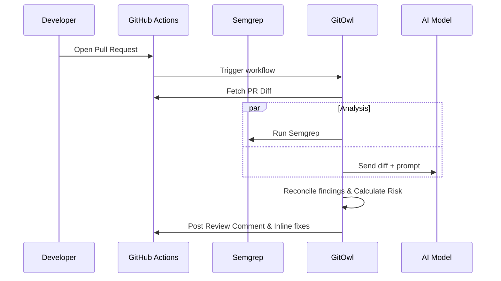

<div align="center">
  

  # GitOwl
  **AI Code Review Engine that lives inside your pull requests.**

  *Filters out noise, scores PR risk, and drops inline suggestions before a human even looks at the code.*
  <br/>
  **Created by Manthan Dubey**

  [](https://gitowl.vercel.app)
  [](https://pypi.org/project/gitowl/)
  [](https://www.python.org/)
  [](LICENSE)

  <br/>

  
  
  
  
  

  <br/>

  **Why I built this:** *Reviewing PRs shouldn't be a bottleneck. I wanted an engine that gives me a quick summary, flags real issues with reasoning, and scores the risk level so I know exactly what needs my attention.*

  <br/>

  [**Live Playground**](https://gitowl.vercel.app) | [**Install locally**](#-install--use-locally) | [**GitHub Action setup**](#-add-gitowl-to-your-repo) | [**Report Bug**](https://github.com/MarutiDubey/GitOwl/issues)

</div>

---

## 🎯 Demo

**Live demo dashboard:** [gitowl.vercel.app](https://gitowl.vercel.app)

*(Screenshot of GitOwl in action coming soon)*

---

## 📑 Contents
- [✨ Features](#-features)
- [🏗️ Architecture](#️-architecture)
- [⚡ Add GitOwl to your repo](#-add-gitowl-to-your-repo)
- [📦 Install & use locally](#-install--use-locally)
- [⚙️ Configuration](#️-configuration)

---

## ✨ Features

- 🔎 **Smart AI Code Review** — Focuses on context and logic, not just syntax matching. Drastically reduces false positives.
- 🚦 **Risk Scoring** — Automatically scores every PR as Low, Medium, or High risk based on the diff complexity.
- 🛡️ **Static Analysis Integration** — Pairs AI with Semgrep to catch known vulnerabilities instantly (optional).
- ✍️ **One-Click Fixes** — Drops GitHub inline suggestions for easy commits.
- 📝 **Auto PR Descriptions** — Generates a title, summary, and change list from the raw diff.
- 💸 **Cost Tracking** — Logs token usage, cost, and latency for every review.
- 🔌 **Provider-Agnostic** — Use any API key (OpenAI, OpenRouter, local Ollama).

---

## 🏗️ Architecture

GitOwl runs locally or in CI/CD pipelines (like GitHub Actions). It processes the diff, coordinates static analysis, queries the LLM, and formats the response straight into your PR.



---

## ⚡ Add GitOwl to your repo

Setup takes about 2 minutes.

**1. Add the GitHub Action**
Create `.github/workflows/gitowl-review.yml` in your repo:

```yaml
- name: Install GitOwl
  run: pip install gitowl

- name: Run Review
  env:
    AI_API_KEY: ${{ secrets.AI_API_KEY }}
    GITHUB_TOKEN: ${{ secrets.GITHUB_TOKEN }}
  run: gitowl review-pr "${{ github.repository }}" "${{ github.event.pull_request.number }}" --post
```

**2. Add your API Key**
Go to **Settings → Secrets and variables → Actions** in your repo and add `AI_API_KEY`. It works with any OpenAI-compatible provider.

*(Note: If you want Semgrep enabled, just use `pip install "gitowl[semgrep]"` in the workflow.)*

---

## 📦 Install & use locally

You can test the engine right from your terminal.

```bash
pip install gitowl
```

Run a review on a local diff:
```bash
git diff main...HEAD | gitowl review-diff -
```

Review a live GitHub PR and post the comment:
```bash
gitowl review-pr owner/repo 42 --post --suggest
```

Generate a PR description:
```bash
gitowl describe-pr owner/repo 42 --post
```

**Environment Variables needed:**
```bash
AI_API_KEY=your_key_here
AI_MODEL=your-model-name
AI_PROVIDER=openrouter
```
*I recommend storing these in a `.env` file.*

---

## ⚙️ Configuration

You can control GitOwl's behavior repo-wide by creating a `.gitowl.toml` file at the root of your project:

```toml
[review]
min_severity = "warning"
ignore_paths = ["tests/**", "**/*.md"]

[ai]
model = "your-model-name"
```
The team shares these rules because they are committed to the repo.

---

## 📄 License
This project is open-source and licensed under the **[MIT License](LICENSE)**.

---

## 👨‍💻 Built By
**Manthan Dubey**
