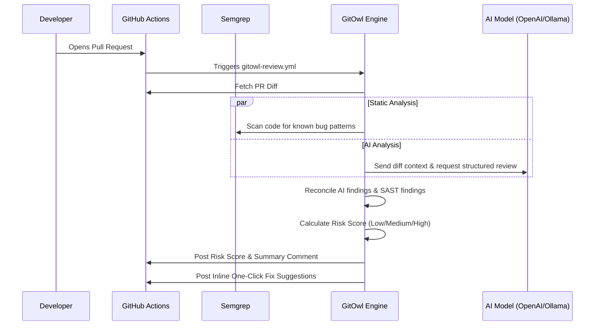

<div align="center">
  

  # GitOwl
  **AI-powered code review that lives inside your pull requests.**

  *A robust, provider-agnostic engine that flags bugs, scores risk, and posts structured reviews before a human ever opens the diff.*
  <br/>
  **Original Concept and Development by Manthan Dubey**

  [](https://gitowl.vercel.app)
  [](https://pypi.org/project/gitowl/)
  [](https://www.python.org/)
  [](LICENSE)

  <br/>

  
  
  
  
  

  <br/>

  > Instead of a human reviewer starting from a cold diff, the team gets an AI summary of what changed, a prioritized list of issues with reasoning, one-click fix suggestions, and an overall risk score — so review time goes to the changes that actually matter.

  <br/>

  [**Live Playground**](https://gitowl.vercel.app) | [**Install**](#-install--use-locally) | [**GitHub Action**](#-add-gitowl-to-your-repo-in-3-steps) | [**Report Bug**](https://github.com/MarutiDubey/GitOwl/issues)

</div>

---

## 🎯 Demo

> 🚧 **Live demo** - [gitowl.vercel.app](https://gitowl.vercel.app)

*(Pro-tip: If you have a screenshot or GIF of GitOwl's inline PR comment, you can place it here in `docs/demo.png`!)*

---

## 📑 Table of Contents
- [✨ Features](#-features)
- [🏗️ Architecture](#️-architecture)
- [⚡ Add GitOwl to your repo](#-add-gitowl-to-your-repo-in-3-steps)
- [🛠️ Tech Stack](#️-tech-stack)
- [📦 Install & use locally](#-install--use-locally)
- [⚙️ Configuration](#️-configuration-gitowltoml)
- [📄 License](#-license)

---

## ✨ Features

- 🔎 **AI Code Review** — Contextual findings with reasoning, not just pattern matches. Filters false positives so the noise stays low.
- 🚦 **Risk Scoring** — Every PR is scored Low / Medium / High from the files touched and the nature of the change.
- 🛡️ **Optional Static Analysis** — Pairs an AI layer with Semgrep when you want both; auto-detected, never required.
- ✍️ **One-Click Fix Suggestions** — Confident fixes are posted as GitHub inline suggestions you can commit in a single click.
- 📝 **Auto PR Descriptions** — Generate a title, summary, and change list straight from the diff.
- 🧠 **Structured Security Insights** — Identifies security issues and provides actionable context, mimicking rigorous security checks.
- ⚙️ **Team-Wide Config** — A committed `.gitowl.toml` sets severity thresholds and ignored paths for the whole repo.
- 💸 **Cost & Latency Tracking** — Every review reports token usage, estimated cost, and latency. No surprises on the bill.
- 🔌 **Provider-Agnostic** — Works with any OpenAI-compatible provider (Ollama, OpenAI, OpenRouter, etc).
- 📊 **Evaluation Harness** — Precision / recall / F1 measured against a seeded-bug corpus, so quality is a number, not a vibe.

---

## 🏗️ Architecture

GitOwl runs efficiently inside your pull requests, acting as an automated first-pass reviewer before a human ever steps in.



---

## ⚡ Add GitOwl to your repo in 3 steps

Get automated AI reviews on every pull request:

### Step 1 — Add the workflow
Copy [`examples/gitowl-review.yml`](examples/gitowl-review.yml) into your repository at `.github/workflows/gitowl-review.yml`:

```yaml
- name: Install GitOwl
  run: pip install gitowl

- name: Review the pull request
  env:
    AI_API_KEY: ${{ secrets.AI_API_KEY }}
    GITHUB_TOKEN: ${{ secrets.GITHUB_TOKEN }}
  run: gitowl review-pr "${{ github.repository }}" "${{ github.event.pull_request.number }}" --post
```

### Step 2 — Add your API key
In your repo, go to **Settings → Secrets and variables → Actions** and add a repository secret named `AI_API_KEY`.
*(You can use a key from **any OpenAI-compatible provider** you already have.)*

### Step 3 — Open a pull request
GitOwl reviews the diff and posts its comment automatically. That's it!

> [!NOTE]
> Want static analysis alongside the AI review? Install with `pip install "gitowl[semgrep]"`.

---

## 🛠️ Tech Stack

| Layer | Tools |
|---|---|
| **Core engine** | Python 3.11+, `httpx`, `unidiff` |
| **AI layer** | Provider-agnostic (any OpenAI-compatible API, local Ollama) |
| **Static analysis** | Semgrep (optional, auto-detected) |
| **Distribution** | PyPI package + GitHub Action |
| **Playground** | React + Vite + TypeScript frontend, Python serverless API (Vercel) |
| **Quality** | `pytest` (166 tests), `ruff`, strict `mypy`, precision/recall Eval Harness |

---

## 📦 Install & use locally

```bash
pip install gitowl          # or:  pip install "gitowl[semgrep]"
```

Point it at a diff or a live pull request:

```bash
# Review a diff — from a file, or piped from git
gitowl review-diff my.diff
git diff main...HEAD | gitowl review-diff -

# Review a GitHub PR and post the comment
gitowl review-pr owner/repo 42 --post

# ...and attach one-click fix suggestions inline
gitowl review-pr owner/repo 42 --post --suggest

# Auto-generate a PR description from the diff
gitowl describe-pr owner/repo 42 --post
```

Configure your provider once via environment variables (or a local `.env`):

```bash
AI_API_KEY=your_key_here          # any OpenAI-compatible provider
AI_MODEL=your-model-name          # e.g. a fast, low-cost chat model
AI_PROVIDER=openrouter            # openrouter | openai | ollama
```

> [!IMPORTANT]
> **API Security:** API keys are read only from the environment / `.env` (which is git-ignored). They never touch the repository config.

---

## ⚙️ Configuration (`.gitowl.toml`)

Drop a `.gitowl.toml` at your repo root to set project-wide review policy. It's committed, so the whole team shares the same rules:

```toml
[review]
min_severity = "warning"                       # info | warning | error
ignore_paths = ["tests/**", "**/*.md"]         # globs GitOwl won't flag

[ai]
model = "your-model-name"                      # pin a model for this repo
```

**Precedence** (low → high): built-in defaults → `.gitowl.toml` → environment variables. The repo file sets the baseline; a CI secret or shell `export` always wins for a single run. API keys are never read from this file.

---

## 📄 License
This project is licensed under the **[MIT License](LICENSE)** — free to use, modify, and build on.

---

## 👨‍💻 Built By
**Manthan Dubey**  
*Designed for precision, low noise, and a seamless developer experience.*
